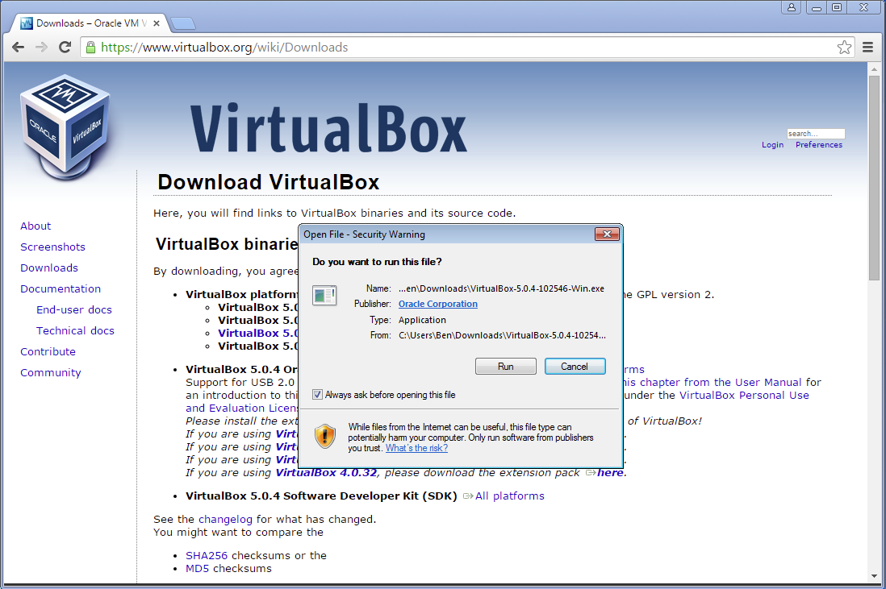
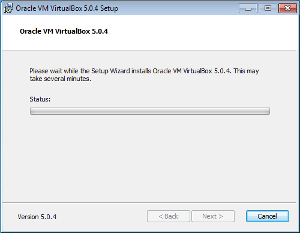
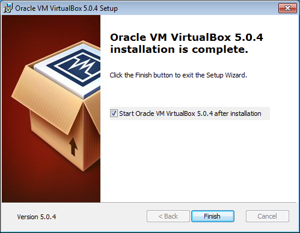
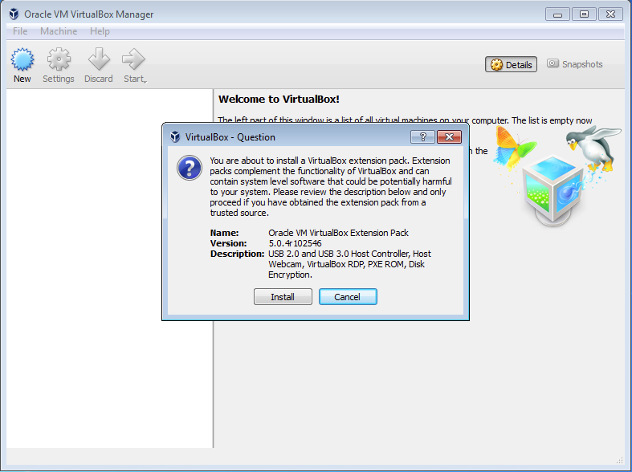
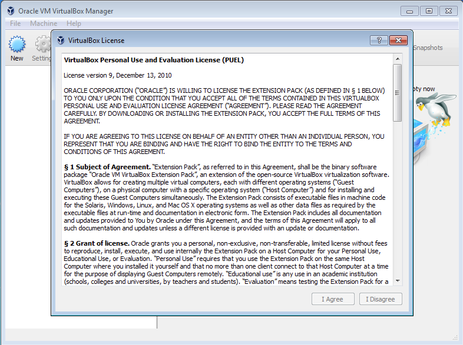
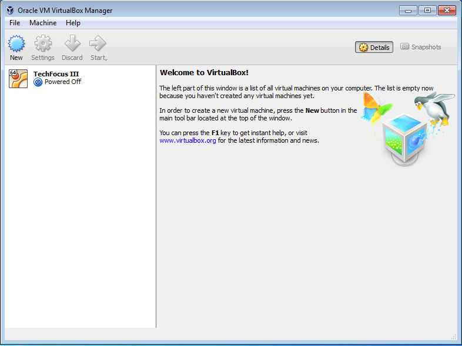
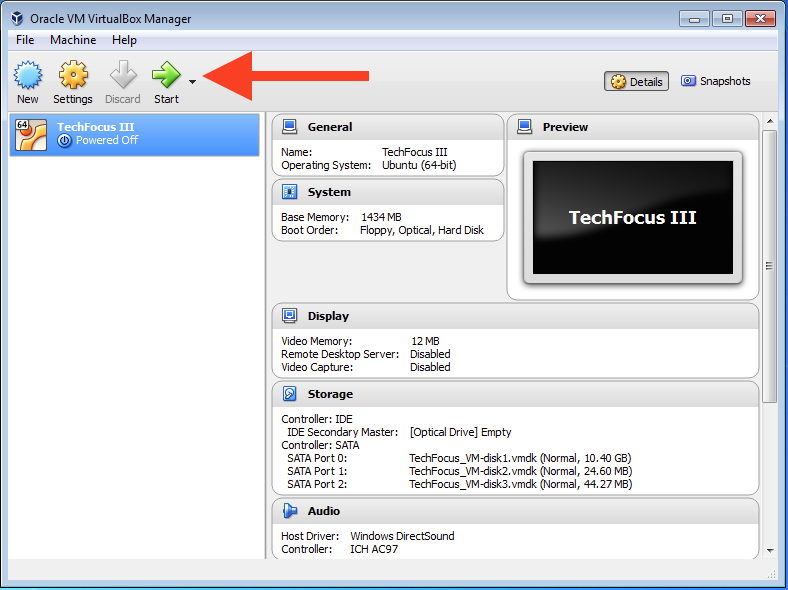
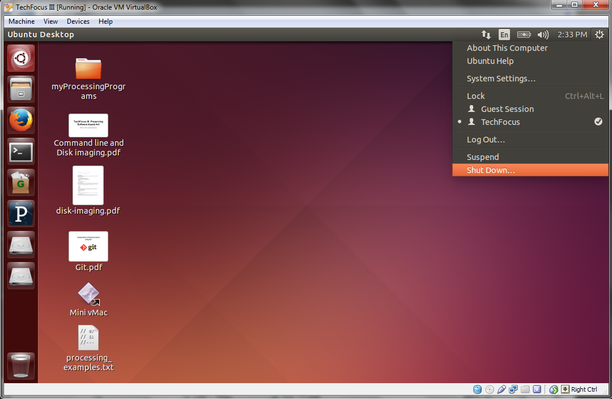

# TechFocus III VirtualBox Installation Instructions for Microsoft Windows

The TechFocus III practical sessions will require the use of very specialized software, as such, we will be providing attendees with a virtual environment that already contains all of the tools and sample files we will be using. In order to use this virtual environemnt there are some setup steps that you *must* take prior to the TechFocus III conference.

## Do this in advance of TechFocus!
**Note:** please carry out these instructions several days in advance of the conference so that you have time to troubleshoot any issues. Note that you may need administrator rights on your computer. If you are using a computer issued by your employer, ask your IT department to install the software for you.

### Step 1: Download VirtualBox

Navigate to [https://www.virtualbox.org/wiki/Downloads](https://www.virtualbox.org/wiki/Downloads), and download the VirtualBox installer for "Windows hosts":

 

Click the "x86/amd64" link. After clicking the link the VirtualBox installer will begin downloading.

 

### Step 2: Run the installer

Open the EXE file that was downloaded. You may see a security warning like this one:

 

Click "Run". This will launch the VirtualBox installer: 

Click "Next". You will then see this window:

Click "Next". You will then see this window:

Click "Next". You will then see this window:

Click "Yes". You will then see this window:

Click "Install". You will then see a progress bar that looks like this:

At this point, you may see an alert that looks like this:

Click "Yes". When installation completes, you will see a window that looks like this:

Un-check the box next to "Start Oracle VM Virtualbox 5.0.4 after installation", and then click "Finish"

### Step 3: Install the VirtualBox Extension Pack

Navigate again to [https://www.virtualbox.org/wiki/Downloads](https://www.virtualbox.org/wiki/Downloads)

Look for the second bullet point that says "VirtualBox 5.0.4 Oracle VM VirtualBox Extension Pack". Click the link that says "All supported platforms". Note that if you encountered issues with VirtualBox 5.0.4 and had to install an older version of VirtualBox, you must install the appropriate/corresponding extension pack version. Otherwise, choose the link pictured here:

After clicking the download link, the extension pack will download to your computer:

Open the extension pack file by double clicking it's icon. This will launch VirtualBox, and you will see the following warning:

Click "Install". Next you will be shown the VirtualBox Personal Use and Evaluation License:

Scroll through and read the license – you must scroll all the way through in order to enable the "agree" button. If you agree to the license, click "I Agree":

Windows may now display the following warning: 

Click "Yes". Next you will see that the extension pack has been sucesfully installed:

### Step 4: Import the virtual machine
TechFocus III Virtal Machine can be downloaded from here: [TechFocus_VM.ova](https://dl.dropboxusercontent.com/u/11471672/TFIII/VirtualBox/TechFocus_VM.ova). This File is 5GB in size and can take a considerable ammount of time to download, depending on the speed of your internet connection. At check-in on Day 1 of TechFocus III, we will be providing the TechFocus Virtual Machine on a USB thumb drive to all attendees, so do not fear if you find downloading this 5GB file to be impossible. Nonetheless, we highly reccommended that you download the TechFocus III Virtual Machine and import it into VirtualBox in advance of TechFocus III, as you may encounter challenges in this process due to some particular characteristic of your computer.

When your download of [TechFocus_VM.ova](https://dl.dropboxusercontent.com/u/11471672/TFIII/VirtualBox/TechFocus_VM.ova) completes, double click the file. This will open VirtualBox and display the following screen:

Click "Import". This will begin the Virtual Machine import process, which can take several minutes. You will see a progress bar as this process completes:

When the import process completes, you will now see your Virtual Machine listed in the left sidebar of the VirtualBox window. 

Click the Virtual Machine's name (TechFocus III). You will now see some of the Virtual Machine's specifications displayed:

Click the green "Start" button at the top of the window:

This is a critical moment – either the Virtual Machine will sucsesfully boot, or you will see an error that means we are not finished. If you see the following error saying "VT-x/AMD-v hardware acceleration is not available on your system", you will unfortunately be unable to run the TechFocus Virtual Machine on your system:

There is a similar error that is less severe – if you see the following error, we will need to enable hardware virtualization in your PC's BIOS.

If you see this error, see the section towards the end of this document titled "enabling virtualization in the BIOS". If you do not see either of these errors, you will definitely see this next popup:

Take note of this message, as it will tell you the keyboard shortcut to switch out of fullscreen mode, should you so desire. Click "Switch". The Virtual Machine will now go into full screen mode, and begin to boot. You may see a black screen for a moment. You will also see a notification that looks like this:

Click "Ok". When your Virtual Machine finshes booting you will see the following:

This is your Linux (Ubuntu specifically) desktop – This virtual Linux computer is loaded with all of the tools and materials we will be using during the TechFocus III workshops. Congratulations on sucsessfully installing virtualbox and importing your TechFocus Virtual Machine! If at any time you decide that you would like to switch out of fullscreen mode, simply use the keyboard shortcut that we saw in the message above before clicking "Switch" (this is usuall the right "ctrl" key and the "f" key). If this does not work, move your mouse all the way to the bottom, center of the screen. A menu will appear – click the "view" menu, and you will see the following:

Click "Switch to fullscreen". This will switch your Virtual Machine to a floating window that is adjustable in size:

When you want to close your Virtual Machine, it is critical that you properly shut it down, just as you would a real computer. To do so, click the gear icon in the upper right hand corner:

Next, click "Shut down…", and click the large shutdown icon that pops up:

This will shut down and close your Virtual Machine.

### Enabling Virtualization in the BIOS
As mentioned previously, if you see the following error, you need to enable virtualization in your PC's BIOS:

It is highly reccommended that you work with your IT department to make these changes. Unfortunately, there are numerous types of BIOS, so the instructions provided here are quite general – your BIOS may look very different than the one pictured below. To reach your PC's BIOS, one has to press a special key during the first few seconds after the computer is powered on – on some computers this is the F1 key – on some it is F12. We reccommend searching the web for instructions on how to reach the BIOS of your specific computer make and model before proceeding. Better yet, search for "BIOS enable virtualization" combined with the make and model name of your PC – you may find step by step instructions for your specific computer.

Your BIOS will look something like this:

The BIOS can be navigated with your arrow keys, and the enter key. Virtualization settings are often found in the "security" section of the BIOS:

Here we are able to move the cursor down to the two presently disabled virtualization features, and by pressing enter, we are given the option to enable the feature.

The BIOS here requires pressing F10 to save and exit. Upon restarting this PC, the TechFocus III Virtual Machine was able to start with hardware virtualization now enabled.

### Technical Assistance
If you encounter any insurmountable errors in setting up your virtual machine, feel free to contact Ben Fino-Radin ([ben_fino-radin@moma.org](mailto:ben_fino-radin@moma.org)) for assistance.

