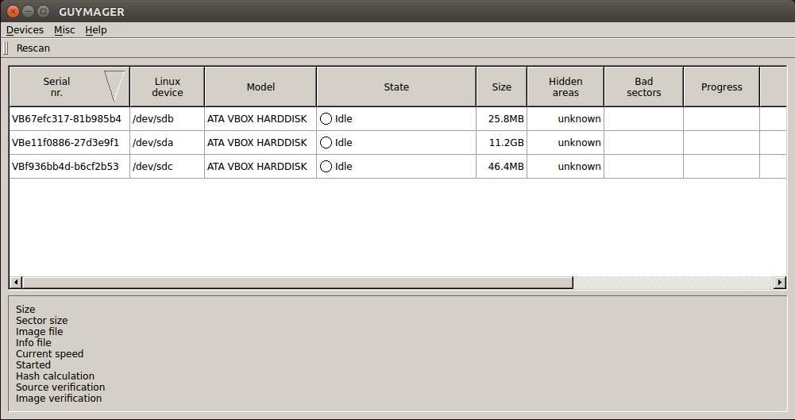
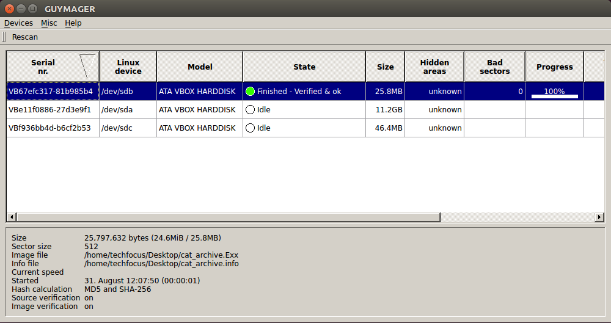

 ```
    ___ _     _       _____                       _               _  ___  _ 
   /   (_)___| | __   \_   \_ __ ___   __ _  __ _(_)_ __   __ _  / |/ _ \/ |
  / /\ / / __| |/ /    / /\/ '_ ` _ \ / _` |/ _` | | '_ \ / _` | | | | | | |
 / /_//| \__ \   <  /\/ /_ | | | | | | (_| | (_| | | | | | (_| | | | |_| | |
/___,' |_|___/_|\_\ \____/ |_| |_| |_|\__,_|\__, |_|_| |_|\__, | |_|\___/|_|
                                            |___/         |___/                                                          
```

### What is a disk image?
A disk image is a file that usually contains a complete and linear "recording" of what your computer sees when it looks at a hard drive, USB drive, CD, DVD, or any other kind of digital carriers of information.

###  Why make disk images?
* To preserve the entireity of a disk as it was delivered by an artist
* To preserve a backup of a dedicated computer that is integral to an artwork
* To "boot" a dedicated computer in a virtual or emulated environment
* To preseve a deeper perspective of the artist provided media, including deleted files

### You will need
1. A way to safely connect the media to your workstation
2. Software for creating the disk image

### Safely connecting media
Most common modern operating systems (Mac and PC) write hidden data to media when it is attached. When handling media that warrants disk imaging, it is almost always advisable to to implmenent measures to prevent any kind of inadvertant modification of the artist provided media. The most commonly used method is to use a hardware device called a write-blocker. A write blocker acts as an intermediary between your workstation, and the media you wish to inspect or disk image. A search online for "write-blocker" will yield reults for various vendors that sell various makes and models of write-blockers. In order to choose the correct model of write blocker, consider the interface formats you face on a day-to-day basis:

* SCSI
* PATA / IDE
* SATA
* USB 2.0
* USB 3.0
* Firewire 400
* Firewire 800

Although the physical form factor of USB 2.0 and 3.0 are identical – their interoperability for write blocking purposes is not reliable. A USB 2.0 write blocker should only be used for USB 2.0 devices, and a USB 3.0 write blcoker should only be used for USB 3.0 devices. At the time of writing there are no commercially available Thunderbolt write blockers.

###  A few tools for creating disk images
* dd – aka Direct Duplicate
* ddrescue
* guymager

Although there are many many more tools one could use for disk imaging, for the purposes of this workshop we will be sticking with these three tools as examples. It warrants mentioning that all three are free and open source.

### Handing control of the USB thumb drive to your Virtual Machine
For this disk imaging exercise we will be making a disk image of the TechFocus USB thumb drive that you were provided at check-in. First – make sure that your Linux virtual machine is running, then plug in the TechFocus USB thumb drive. If the USB thumb drive was already plugged in when you started your virtual machine, please unplug it, and then plug it back in. This initial step is just to ensure that your Linux virtual machine has full control of the thumb drive, rather than your "real" computer.

### Preparing for disk imaging

Before we can dive into using dd, ddrescue, and guymager to actually make disk images, there is some initial preparation that we need to do. Firstly, we need to find what is essentially an identifier your computer uses to refer to the USB thumb drive as a physical device.

Type `mount` in your terminal and press enter. You will see something similar to this, though there may be slight variation:

```
/dev/sda1 on / type ext4 (rw,errors=remount-ro)
proc on /proc type proc (rw,noexec,nosuid,nodev)
sysfs on /sys type sysfs (rw,noexec,nosuid,nodev)
none on /sys/fs/cgroup type tmpfs (rw)
none on /sys/fs/fuse/connections type fusectl (rw)
none on /sys/kernel/debug type debugfs (rw)
none on /sys/kernel/security type securityfs (rw)
udev on /dev type devtmpfs (rw,mode=0755)
devpts on /dev/pts type devpts (rw,noexec,nosuid,gid=5,mode=0620)
tmpfs on /run type tmpfs (rw,noexec,nosuid,size=10%,mode=0755)
none on /run/lock type tmpfs (rw,noexec,nosuid,nodev,size=5242880)
none on /run/shm type tmpfs (rw,nosuid,nodev)
none on /run/user type tmpfs (rw,noexec,nosuid,nodev,size=104857600,mode=0755)
none on /sys/fs/pstore type pstore (rw)
systemd on /sys/fs/cgroup/systemd type cgroup (rw,noexec,nosuid,nodev,none,name=systemd)
gvfsd-fuse on /run/user/1000/gvfs type fuse.gvfsd-fuse (rw,nosuid,nodev,user=techfocus)
/dev/sr0 on /media/techfocus/VBOXADDITIONS_5.0.0_101573 type iso9660 (ro,nosuid,nodev,uid=1000,gid=1000,iocharset=utf8,mode=0400,dmode=0500,uhelper=udisks2)
/dev/sdb3 on /media/techfocus/Macintosh HD type hfs (rw,nosuid,nodev,allow_other,default_permissions,blksize=4096)
/dev/sdb2 on /media/techfocus/TechFocus type fuseblk (rw,nosuid,nodev,allow_other,default_permissions,blksize=4096)
```

This is a list of all of the mounted devices in your Linux virtual machine. Look for the line that mentions `Macintosh HD`. You will see that this line has three parts, first something that looks like `/dev/sdb3`, followed by `/media/techfocus/Macintosh HD`, and finally followed by `type fuseblk`. In other words:

```
/dev/sbd3 /media/techfocus/Macintosh HD type hfs
```

The second part of the line you will recognize as being the name of one of the USB thumb drive – this is what we call the "Volume". It is what you as a user see when you plug in a readable piece of media – it is where you see all of your files. The first part of the line `/dev/sdb3` is called the "device file" – this is where your computer assigns a location in its filesystem for the physical device of the USB thumb drive itself. This piece of information – the device file – is of crucial importance, and we will need it later, so write it down.

Now that we have the device file, we need to "unmount" the "Volume". The USB device is currently preoccupied with talking to your operating system so that it can show you the `Macintosh HD` Volume and the files inside it. We need its full attention so that `dd` can read it in full. To unmount the Mac IIci Volume, type the following into your terminal and press enter (note the `\` after the word `Macintosh` this time. In the terminal, when you type in file paths with spaces you need to tell the computer that the space is intentional, and that you are continuing the file path. Computers unfortunately really are that dumb.):

```
$ sudo umount /media/techfocus/Macintosh\ HD/
```
***Important:*** the `$` in the above line is not for you to type into your terminal. As you may have noticed when you opened your terminal, a new line begins with `techfocus@techfocus-VirtualBox:~$`. The `$` symbol is standardly used to indicate the begining of the command prompt. At this point we now have our device file, and we have unmounted the Volume we would like to image – and so we are ready to disk image!


### Using dd

To begin, open up your terminal. To read the manual for dd, type `man dd` and press enter. `Man` in this case is short for `manual`. As you can see, `dd` has many options. The two we only really care about for this exercise are `if` and `of` – these are short for "input file"" and "output file" or some variant of those words. Press `q` to exit the man page. The basic syntax we want to use for making a disk image with `dd` is as follows (remember, don't actually type the `$` symbol!):

```
$ dd if=[device file goes here] of=[path to write disk image to]
```
The text inside the `[ ]` brackets is of course a placeholder to explain what actually should go in this place. This use of square brackets is very commonly used in examples of propper usage of command line tools. As you can see, after `if=` we are supposed to write the device file of the disk we want to image. So this should look something like `if=/dev/sdb3`. The output file is the full file path to where we would like to write the disk image – including the name of the disk image and its file extension. Let's put the disk image on our Desktop and call it `Macintosh_HD.001`. This means your `of=` should now read `of=/home/techfocus/Desktop/Macintosh_HD.001`. Stiching it all together, your full and complete command will look something like this:

```
$ dd if=/dev/sdb3 of=/home/techfocus/Desktop/Macintosh_HD.001
```
Type or copy/pase the above and press enter to begin the process of imaging your disk. You will notice that there is absolutely no indication as to what is happening – is the disk imaging process running? Is it working? Has your computer frozen? By default `dd` does not provide the user with any useful feedback or output. It would be good to coax some information out of it so that we know the process is working, and so that we can get an idea of how far along it is in the process.

In a new terminal window, type `killall -USR1 dd` and press enter. When you return to your terminal window where `dd` is running, you will now see some information displayed. This command forces `dd` to tell us how far along it is – but as you can see it only tells us once. In order to get a constant feed of `dd`'s progress, we will use the `watch` command. Open a new terminal window, type the following command, and press enter:

```
$ watch -n 1 'killall -USR1 dd'
```

This tells our computer to repeat the `killall` command every second - and thus we are shown `dd`'s progress every second. This is a bit cumbersome though, so lets look at a slightly more featured program that is similar to `dd` but more user-friendly.

### Using ddrescue
In your terminal, type `ddrescue --help` and press enter. As you can see, ddrescue has many options. We actually are not going to use any of them today. `ddrescue`'s syntax is very similar to `dd`, but a bit simpler: `ddrescue [input file] [output file]`. As you can see, `ddrescue` does not have the same `if=` `of=` paradigm as `dd` – you simply type the name of the program, follwed by the device file of the disk you wish to image, followed by the path to and filename of the disk image. This time we will make a disk image of a different drive. Thus we first need to unmount it:

```
$ sudo umount /media/techfocus/Ben\'s\ PC/
```

Then give this a try:

```
$ sudo ddrescue if=/dev/sdb1 of=/home/techfocus/Desktop/Bens_PC.001
```

This time we are disk imaging a different volume of the USB thumb drive. As you can see, `ddrescue`'s output is much more useful – right out of the box we can see what the program is doing. It will even tell us if there are any errors in reading the source disk – while if this occurs with `dd`it will silently continue. So now we can make raw disk images using two free and open source command line tools. This is great – and as discussed previously, raw images are wonderful for preservation – but there are three big limitations with these tools and with raw images:

* we are not validating the disk image
* we are not capturing metadata about its creation
* we are not generating a checksum that can be validated later

### Forensic Disk Image Formats
There are alternatives to raw disk images that address the above three concerns. Forensic disk image formats (the name being owed to the fact that such file formats were created in response to the needs of criminal forensics) include embedded metadata about the moment of acquisition, or capture – both information manually entered by the creator of the disk image, but also automatically captured information about the source disk and system capturing the disk. This is all good news for long-term preservation as this ensures that information of the provenance of a given disk image is inherent in the image itself. Two downsides to forensic disk image formats are that A) all formats are proprietary, and B) support of forensic disk images in emulators and virtualization platforms is spotty, and often an image will need to be converted for use with such tools. The Encase forensic disk image format is arguably the most widely adopted format, and it has been thoroughly reverse engineered and is supported by various free and open source tools. One such tool we will look at now is called Guymager.

### Using Guymager
You will be happy to learn that we will now be leaving the command line! Guymager, a free and open source tool for creating disk images, has a Graphical User Interface (GUI). Launch Guymager either by typing `sudo guymager` in your terminal, or by clicking the Guymager icon in the application launcher. When Guymager launches you will see a window similar to this:



This screen lists all of your attached storage devices. You should see your USB thumb drive listed. In the "Linux device" column you should see `USB DISK 2.0`. Guymager only allows one to create physical disk images - in other words - our USB thumb drive is partitioned into three mountable volumes. With `dd` and `ddrescue` we were creating logical images of specific volumes of the USB thumb drive. A physical image is most desireable from a preservation standpoint as it is the most complete capture possible. Right click anywhere on the row for this device and choose "acquire image" from the contextual menu. 


Next you will see the following window:


Make sure to select `Expert Witness Format`. The "Split size" option is in case you wish to divide the disk image into many small files rather than one large file. For our purposes we will stick with one file. The way to trick the software into doing this is to set a split size that is absurdly large. In the above figure we have set the split size to 99,999 TB. Below this are the `case number`, `evidence number`, `examiner`, `description`, and `notes` fields. These metadata fields are obviously designed for use in a criminal investigation setting, however it is not difficult to imagine how they may be adapted to suit the needs of cultural heritage – i.e. using `case number` for an accession number, `evidence number` for a more granular identifier, `examiner` recording who created the disk image, and `description` and `notes` being of course already generic. Complete each of these fields as you see fit. Click the "..." button to select the image directory (choose the Desktop), complete the file name, and info filename. In the `Hash calculation / verification` area at the bottom, make sure `Calculate MD5` and `Calculate SHA-256` are checked, as well as the last two check boxes: `Re-read source…` and `Verify image…`. These last two features are critical as they not only ensure that the disk image will be compared to the source disk bit-for-bit to ensure that a good copy was recorded, but also, that the disk will be read a second time for this comparison, so as to ensure that there were no undeteced read errors during imaging. Double check all of your settings, and click `start`. You should now see some feedback in the Guymager GUI.


Normally we would wait for the disk imaging, and verification processes to complete, however your computer most likely does not have enough free space to complete this image. When the imaging and verification process is complete, you should see `Finished - Verified & ok`:



Congratulations – you are the proud new owner of a forensic disk image!

### Beyond the disk image
Disk imaging is a crucial baseline process in digital preservation and conservation, but creating one and properly storing it in a digital repository is only part of the story. In many ways a disk image can be thought of as a black box. Just as we can not assume that in 100 years people will have the proper software to play a Quicktime, and that we must accompany files with `representation information` about their makeup – it is advisable to do the same with disk imgages.

### Fiwalk
Using a command line based tool called `fiwalk` we can extract metadat about the filesystem contained within a disk image. Let's use this tool to generate metadata about the `Ben's PC` disk image. In your terminal type the `fiwalk` command, followed by a `space`, and then drag and drop the `Bens_PC.001` disk image we produced with ddrescue directly into your terminal window. Your command should read like so:

```
$ fiwalk /home/techfocus/Desktop/Bens_PC.001
```
Press enter. Fiwalk is now extracting information about the filesystem contained within the disk image – including an MD5 and SHA1 checksum for every single file. `fiwalk` is only outputting this metadata to the command line - we of course want to record this information in file form. `fiwalk` supports the output of XML in the Digita Forensics XML (DFXML) format. If your first fiwalk command is still running, press and hold the `control` button on your keyboard, and while holding control, press the letter `c`. This is called a `keyboard intterupt`, and is a way of halting a running program in your terminal. Now, press the up arrow on your keyboard. This will recall the last command that you typed. At the end of your command, add the following: `-X ~/Desktop/fiwalk.xml` Your full command should now look like this:
```
$ fiwalk /home/techfocus/Desktop/Bens_PC.001 -X ~/Desktop/fiwalk.xml
```
Press enter. Switching the `fiwalk` output to XML means that you will not see any output from the tool until it finishes. When the process completes you will see a new line in your terminal with a blinking cursor. When you see this new line, type `gedit ~/Desktop/fiwalk.xml` and press enter. This will open the XML file in a text editor so that we can read it. Feel free to browse around and get a feel for what DFXML looks like.


### Emulation
Lastly we will take a quick look at how emulation can provide a novel type of access to disk images. Let's say that your institution has collected acquired the archive of an artist, and that this archive includes the artst's personal computer – a Macintosh IIci.


You know well that you can not simply store this computer indefinitely as a preservation strategy, and because you attended the TechFocus III workshop you know how to create a disk image of the computer's hard drive. You disk image the computer, store this disk image in your instutition's repository, but then what? Let's take a look at how we can use an emulator to breathe life back into this disk image, so that it can serve as a proxy for the original computer. On the desktop of your virtual machine, you will find a folder named `Mini vMac`. Open it. Inside you will find three files, `MacII.ROM`, `Macintosh_IIci.001`, and `Mini vMac`. `Mini vMac` is an emulator – in this case it has been built to specifically emulate a Macintosh IIi, since this was the kind of computer the artist was using. `MacII.ROM` is a file that gives instructions to the emulator when it is first run – this ROM was extracted from a Mac IIci. The `Macintosh_IIci.001` file is a raw disk image of the artist's computer's hard drive. Let's launch the emulator – double click the purple `Mini vMac` icon. Initially you will see a window with a flashing disk icon:


Once you see this screen, return to the Mini vMac folder, drag and drop the `Macintosh_IIci.001` file onto the Mini vMac window with the flashing disk – like so:


You should now see the computer begin to boot, and eventually you will be presented with a desktop – take a look around! Everything is exactly as the artist left it – everything from the software they used, to their placement of icons. When you are finished looking around, shut down the computer from the `special` menu. Never simply quit the emulator as this can potentially corrupt the disk image.

### Conclusion
This concludes the TechFocus III practical session on disk imaging, metadata extraction, and emulation. If you have any follow up questions please feel free to contact the instructor: ben_fino-radin@moma.org.


### Further reading
* [The Forensics Wiki](http://forensicswiki.org)
* [BitCurator](http://www.bitcurator.net/)


